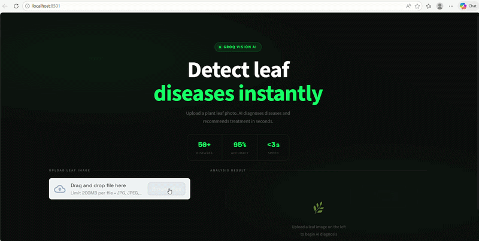

# 🌿 LeafScan AI - Leaf Disease Detection

[](https://www.python.org/)
[](https://fastapi.tiangolo.com/)
[](https://streamlit.io/)
[](https://groq.com/)
[](LICENSE)

An AI-powered web application that detects plant leaf diseases from uploaded images and provides expert treatment recommendations — built with Python, FastAPI, Streamlit and Groq Vision API.

---
## 🎥 Demo


## 🚀 Features

- 📸 Upload any plant leaf image (JPG, JPEG, PNG)
- 🤖 Instant AI-powered disease diagnosis using Groq Vision API
- 📊 Displays disease name, type, severity and confidence score
- 💊 Provides symptoms, possible causes and treatment plan
- 🎨 Clean dark-themed responsive UI built with Streamlit
- ⚡ Sub-3-second response time

---

## 🛠️ Tech Stack

| Layer | Technology |
|-------|------------|
| Language | Python 3.13+ |
| Frontend | Streamlit |
| Backend | FastAPI |
| AI Model | Groq Vision API (LLaMA) |
| Deployment | Vercel |

---

## ⚙️ How to Run Locally

### 1. Clone the repository
```bash
git clone https://github.com/Naina823/Leaf-Disease-Detection.git
cd Leaf-Disease-Detection
```

### 2. Create virtual environment
```bash
python -m venv venv
venv\Scripts\activate
```

### 3. Install dependencies
```bash
pip install -r requirements.txt
```

### 4. Start the backend
```bash
uvicorn app:app --reload
```

### 5. Start the frontend
```bash
streamlit run main.py
```

### 6. Open in browser
```
http://localhost:8501
```

---

## 📡 API Endpoint

| Method | Endpoint | Description |
|--------|----------|-------------|
| POST | `/disease-detection-file` | Upload leaf image for analysis |
| GET | `/` | API status and info |

---

## 📸 How It Works

1. User uploads a leaf image on the web interface
2. Image is sent to the FastAPI backend
3. Backend calls Groq Vision AI (LLaMA model)
4. AI analyzes the image and returns structured results
5. Frontend displays disease name, severity, symptoms and treatment

---

## 📁 Project Structure
```
Leaf-Disease-Detection/
├── main.py          # Streamlit frontend
├── app.py           # FastAPI backend
├── utils.py         # Helper functions
├── test_api.py      # API tests
├── requirements.txt # Dependencies
└── README.md
```

---

## 👩‍💻 Made by Naina823

[GitHub](https://github.com/Naina823) • [Repository](https://github.com/Naina823/Leaf-Disease-Detection)

---

⭐ Star this repo if it helped you!